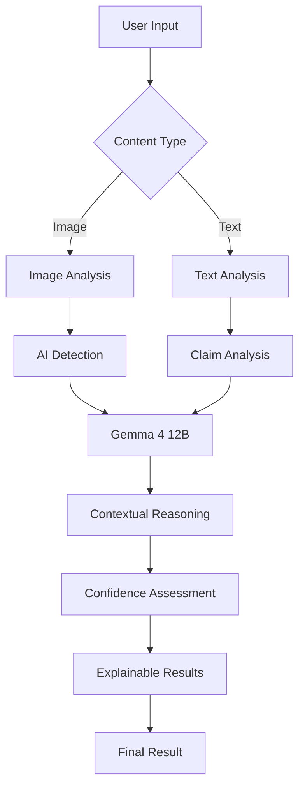

#  VeriSight


> VeriSight is an AI-powered platform that analyzes images and text to detect potentially fake, manipulated, or misleading content and provides clear, explainable results.

## Team

**Team Name:** Ghost Protocol


| Member | Contribution   |
| ------ | -------------- |
| Sutharsan R |Frontend Development & UI/UX Design  |
| Jai Nivas V |AI Detection Model Development & Evaluation|
| Mithun Karthik Dhaneshkumar |Problem Research, Dataset Preparation & Solution Design|
| Rohith N M |Gemma 4 12B Integration & AI Reasoning |


## Problem Statement

### The Problem

The rapid advancement of generative AI has made it easier to create realistic AI-generated images and misleading text, making it difficult for people to distinguish genuine content from fake or manipulated information. This problem affects everyday internet users, students, organizations, and the general public, especially when misleading content spreads through social media, messaging platforms, online news, and other digital channels.

In today’s digital environment, people consume and share large amounts of information every day, often without having the time or technical knowledge to verify its authenticity. The lack of simple, accessible, and explainable verification tools can lead users to believe, share, or act on false information.
### Why We Chose This Problem

We chose this problem because AI-generated and misleading content is becoming increasingly difficult to identify, while such content can spread rapidly across social media and online platforms. False information can influence people's decisions, create confusion, and cause real-world harm.

We believe there is a need for a simple, accessible, and explainable solution that helps users evaluate suspicious images and text. Our goal is to use open-source AI not just to detect potentially fake content, but also to explain why it may be suspicious, helping users make more informed decisions.

## Solution

We propose an AI-powered content verification platform that analyzes images and text to identify potentially AI-generated, manipulated, or misleading content. Users can upload an image or enter text, and the system analyzes the content using AI models to detect suspicious patterns and misinformation.

The platform uses Gemma 4 12B for intelligent text analysis and reasoning, along with image analysis techniques to evaluate visual content. Instead of providing only a “Fake” or “Real” result, the system provides a confidence score and clear explanations about why the content may be suspicious.

This helps users quickly evaluate questionable content, understand the reasoning behind the result, and make more informed decisions before believing or sharing it.

### Key Features

- **AI-Generated Image Detection** — Analyze images to identify potential AI generation or manipulation.
- **Misinformation Detection** — Analyze text to identify potentially false, misleading, or suspicious claims.
- **Gemma 4 12B Reasoning** — Use an open-weight AI model to analyze content and provide meaningful explanations.
- **Explainable Results** — Provide confidence scores and clear reasons behind the analysis instead of simply labeling content as “Fake” or “Real.”

## Innovation and Differentiation

VeriSight goes beyond traditional “fake or real” detection by combining image analysis and text-based misinformation detection in a single platform. Instead of providing only a prediction, it uses Gemma 4 12B to reason about the analyzed content and provide users with understandable explanations, confidence levels and clear explanations.

The key difference is its focus on explainable verification. Users can understand why content may be suspicious rather than simply receiving a binary result. This makes VeriSight more transparent, accessible, and useful for everyday users evaluating content encountered online.

## Technical Implementation

### Architecture


[Add the system architecture or workflow Mermaid diagram here.]

### Technology Stack


| Category        | Technologies                |
| --------------- | --------------------------- |
| Frontend        | [Technologies / N/A]        |
| Backend         | [Technologies / N/A]        |
| Database        | [Technologies / N/A]        |
| AI / ML         | [Models / frameworks / N/A] |
| Infrastructure  | [Technologies / N/A]        |
| APIs / Services | [Services / N/A]            |


If a category or technology is not implemented in the project, specify `N/A` instead of leaving the field blank.

### How It Works

[Explain the major components of the system and how they interact.]

### Technical Decisions

[Explain important architectural, algorithmic, or engineering decisions made during development.]

## Implementation During the Hackathon

[Describe what the team built during the Hack Day and the major functionality or components completed during the event.]

### Team Contributions

- **[Member Name]:** [Contribution]
- **[Member Name]:** [Contribution]
- **[Member Name]:** [Contribution]
- **[Member Name]:** [Contribution]

## Working Application

**Live Application:** [Live URL]

[Briefly explain how the deployed application can be accessed and what functionality can be tested.]

The submitted application should be functional and accessible through the provided link where applicable.

## Demo Video

**Demo Video:** [Video URL]

[Provide a short demonstration of the working project, covering the main user flow and important functionality.]

## Open Source and AI Usage

### AI / Models

- **[Model]:** [How it is used]

### Open Source Components

- **[Library / Framework]:** [Purpose]
- **[Dataset]:** [Purpose]
- **[API / Service]:** [Purpose]

[Include relevant licenses, attribution, and acknowledgements for external components.]

## Setup and Usage

### Prerequisites

- [Requirement]
- [Requirement]

### Installation

```bash
git clone [repository-url]
cd [project-directory]
[installation-command]
```

### Environment Variables

```env
[VARIABLE_NAME]=[value]
```


### Running the Project

```bash
[run-command]
```

### Usage

[Explain the basic steps required to use the project.]

## Devpost Submission

**Devpost Project:** [Devpost Project URL]

[Add the link to the team's Devpost submission. Ensure the Devpost project page is complete and contains the required project information, links, media, and team details.]

## Credits and License

### Credits

[Credit libraries, frameworks, datasets, models, APIs, contributors, and other external resources used.]

### License

[License name and/or link.]

## Submission Checklist

- [ ] Project title and description added
- [ ] All team members listed
- [ ] Problem clearly explained
- [ ] Reason for choosing the problem explained
- [ ] Solution and key features documented
- [ ] Innovation and differentiation explained
- [ ] Architecture included
- [ ] Technical implementation documented
- [ ] Work completed during the hackathon documented
- [ ] Team contributions documented
- [ ] Working application is functional
- [ ] Live application link added where applicable
- [ ] Demo video added
- [ ] AI and open-source components documented
- [ ] Setup and usage instructions tested
- [ ] Challenges and learnings documented
- [ ] Devpost submission completed
- [ ] Devpost link added
- [ ] Credits added
- [ ] License added
- [ ] Repository is organized and complete
