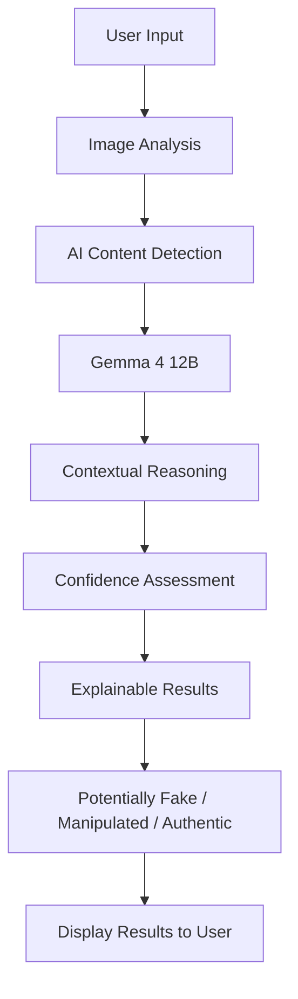

# TruthLens AI

> TruthLens is an AI-powered platform that analyzes images to detect potentially fake or manipulated content and provides clear, explainable results.

## Team

**Team Name:** Ghost Protocol

| Member | Contribution |
| ------ | ------------ |
| **Sutharsan R** | Frontend Development & UI/UX Design |
| **Jai Nivas V** | AI Detection Model Development & Evaluation |
| **Mithun Karthik Dhaneshkumar** | Problem Research, Dataset Preparation & Solution Design |
| **Rohith N M** | Gemma 4 12B Integration & AI Reasoning |

## Problem Statement

### The Problem

The rapid advancement of generative AI has made it easier to create realistic AI-generated and manipulated images, making it difficult for people to distinguish genuine images from fake or manipulated content. This problem affects everyday internet users, students, organizations, and the general public, especially when misleading images spread through social media, messaging platforms, online news, and other digital channels.

In today’s digital environment, people consume and share large amounts of visual information every day, often without having the time or technical knowledge to verify its authenticity. The lack of simple, accessible, and explainable image verification tools can lead users to believe, share, or act on manipulated or AI-generated images.

### Why We Chose This Problem

We chose this problem because AI-generated and manipulated images are becoming increasingly difficult to identify, while such content can spread rapidly across social media and online platforms. False or manipulated images can influence people's decisions, create confusion, and cause real-world harm.

We believe there is a need for a simple, accessible, and explainable solution that helps users evaluate suspicious images. Our goal is to use open-source AI not just to detect potentially fake images, but also to explain why an image may be suspicious, helping users make more informed decisions.

## Solution

We propose an AI-powered image verification platform that analyzes images to identify potentially AI-generated or manipulated content. Users can upload an image, and the system analyzes it using AI models to detect suspicious visual patterns.

The platform uses Gemma 4 12B for intelligent reasoning, along with image analysis techniques to evaluate visual content. Instead of providing only a “Fake” or “Real” result, the system provides a confidence score and clear explanations about why the image may be suspicious.

This helps users quickly evaluate questionable images, understand the reasoning behind the result, and make more informed decisions before believing or sharing them.

### Key Features

- **AI-Generated Image Detection** — Analyze images to identify potential AI generation or manipulation.
- **Deepfake Detection** — Detect potential deepfake or manipulated content in uploaded images.
- **Gemma 4 12B Reasoning** — Use an open-weight AI model to analyze detection results and provide meaningful explanations.
- **Explainable Results** — Provide confidence scores and clear reasons behind the analysis instead of simply labeling content as “Fake” or “Real.”

## Innovation and Differentiation

TruthLens goes beyond traditional “fake or real” detection by combining image analysis with AI-powered reasoning in a single platform. Instead of providing only a prediction, it uses Gemma 4 12B to reason about the analyzed image and provide users with understandable explanations and confidence levels.

The key difference is its focus on explainable verification. Users can understand why an image may be suspicious rather than simply receiving a binary result. This makes TruthLens more transparent, accessible, and useful for everyday users evaluating images encountered online.

## Technical Implementation

### Architecture



### Technology Stack

| Category | Technologies |
| ------------------- | ----------------------------------------------------------------------------- |
| **Frontend** | React.js, Vite, Tailwind CSS, Lucide Icons |
| **Backend** | Python, FastAPI, Uvicorn |
| **Database** | N/A — no database required for the MVP; files are processed locally |
| **AI / ML** | PyTorch, Hugging Face Transformers, CommunityForensics-DeepfakeDet-ViT, Gemma |
| **Infrastructure** | Local Windows environment, NVIDIA CUDA GPU, Ollama |
| **APIs / Services** | FastAPI REST API, Ollama API (local), Hugging Face Model Hub |

### How It Works

TruthLens AI accepts image input through the React.js frontend. Images are processed using the **CommunityForensics-DeepfakeDet-ViT** deepfake detection model. The processed results are sent through the FastAPI backend, which coordinates the AI pipeline and passes relevant information to **Gemma 4 12B through Ollama** for contextual reasoning. The system then generates a confidence assessment and explanation, which is displayed to the user through the frontend.

### Technical Decisions

**React.js + Vite + Tailwind CSS** were chosen to build a fast, responsive, and simple user interface.

**FastAPI** was used for the backend because it provides a lightweight and efficient REST API for connecting the frontend with AI models.

**CommunityForensics-DeepfakeDet-ViT** was selected for image-based deepfake detection.

**Gemma 4 12B** is used through Ollama as the reasoning layer to interpret image detection results and provide contextual explanations.

**PyTorch and Hugging Face Transformers** provide the machine-learning infrastructure for model loading and inference.

The MVP uses **local processing** without a database, reducing complexity and helping keep user-submitted content local.

**NVIDIA CUDA** is used to accelerate model inference when a compatible GPU is available.

## Implementation During the Hackathon

During the Hack Day, our team developed the core TruthLens prototype for analyzing suspicious images. We implemented the frontend interface for image input, integrated the backend API, and connected the AI models for image analysis.

The major components completed during the hackathon include:

- **Image analysis** using the CommunityForensics-DeepfakeDet-ViT model.
- **Gemma 4 12B integration** through Ollama for contextual reasoning and explanation.
- **FastAPI backend** to connect the frontend with the AI pipeline.
- **Confidence-based and explainable results** instead of simple fake/real predictions.
- **Responsive frontend** built with React.js, Vite, and Tailwind CSS.

The completed prototype demonstrates an end-to-end workflow from **image input → AI analysis → reasoning → explainable verification results**.
### Team Contributions

- **Sutharsan R:** Frontend Development & UI/UX Design
- **Jai Nivas V:** AI Detection Model Development & Evaluation
- **Mithun Karthik Dhaneshkumar:** Problem Research, Dataset Preparation & Solution Design
- **Rohith N M:** Gemma 4 12B Integration & AI Reasoning

## Working Application

**Live Application:** Deployed Locally

The application provides an interactive interface where users can upload an image for AI-powered deepfake and manipulation detection. The system analyzes the uploaded image and provides a confidence-based result along with an explanation of the detection.

## Demo Video

**Demo Video:** https://youtu.be/PCBUWXBHMoY?si=xNPIyB_qXr5T7FBK

The demo showcases the complete workflow of TruthLens, including image upload, AI-based analysis, Gemma 4 12B reasoning, and the final explainable verification result.


## Open Source and AI Usage

### AI / Models

* **CommunityForensics-DeepfakeDet-ViT:** Pre-trained Vision Transformer model used as the primary AI-based forensic detector for identifying characteristics associated with AI-generated or manipulated images.
* **Gemma (`custom-gemma:latest`):** Locally hosted Gemma model accessed through Ollama. It acts as an AI investigator that interprets the detector and traditional forensic findings and generates human-readable explanations and investigation summaries.

### Open Source Components

* **React.js:** Frontend user interface.
* **Vite:** Frontend development and build tooling.
* **Tailwind CSS:** Responsive and modern user interface styling.
* **FastAPI:** Python backend and REST API.
* **PyTorch:** Deep learning inference framework.
* **Hugging Face Transformers:** Loading and running the CommunityForensics Vision Transformer model.
* **Pillow:** Image loading and processing.
* **OpenCV:** Image processing and traditional forensic analysis.
* **NumPy:** Numerical and image-statistical computations.
* **SciPy:** Scientific and frequency-domain computations.
* **Ollama:** Local runtime used to run the Gemma model.
* **CommunityForensics-DeepfakeDet-ViT:** Pre-trained image-forensics model used for AI-generated image detection.
* **Gemma:** Local AI model used for evidence interpretation and explanation.

All external libraries, models, and frameworks remain subject to their respective licenses and attribution requirements. Their original authors and contributors are acknowledged.

## Setup and Usage

### Prerequisites

* Python 3.11 or later
* Node.js and npm
* Git
* NVIDIA GPU with CUDA support recommended for faster image inference
* Ollama installed and running
* Gemma model available through Ollama
* Internet connection for the initial installation and model download

### Installation

```bash
git clone https://github.com/Sutharsan11308-git/hacktoberfest-hack-day-coimbatore-x-init-club-and-idea-club
cd truthlens-ai

python -m venv venv

# Windows
venv\Scripts\activate

pip install -r backend/requirements.txt

cd frontend
npm install
```

### Environment Variables

```env
MODEL_ID=buildborderless/CommunityForensics-DeepfakeDet-ViT
OLLAMA_MODEL=custom-gemma:latest
OLLAMA_ENDPOINT=http://localhost:11434
```

If the current application does not actually use a `.env` file, these values should instead be described as application configuration rather than environment variables.

### Running the Project

Start Ollama and make sure the Gemma model is available:

```bash
ollama list
```

Start the backend:

```bash
cd backend
uvicorn main:app --reload --port 8000
```

Start the frontend in another terminal:

```bash
cd frontend
npm run dev
```

The frontend will normally be available at:

```text
http://localhost:5173
```

The backend API will normally be available at:

```text
http://localhost:8000
```

### Usage

1. Open the TruthLens AI web application.
2. Upload or drag and drop an image into the investigation interface.
3. Click **Investigate**.
4. TruthLens AI analyzes the image using the CommunityForensics detector and traditional forensic techniques.
5. The evidence is aggregated into an overall evidence score and investigation verdict.
6. Gemma interprets the collected evidence and generates a human-readable explanation.
7. Review the investigation summary and, if required, open the technical details for the underlying forensic measurements.

TruthLens AI provides probabilistic forensic analysis and should not be treated as definitive proof of authenticity, manipulation, or AI authorship.

## Devpost Submission

**Devpost Project:** [Devpost Project URL]

The Devpost project page contains the project description, problem statement, solution, technology stack, demonstration materials, repository link, team information, and other required submission details.

## Credits and License

### Credits

TruthLens AI acknowledges the open-source communities and developers behind:

* CommunityForensics and the `CommunityForensics-DeepfakeDet-ViT` model
* Hugging Face Transformers
* PyTorch
* React
* Vite
* Tailwind CSS
* FastAPI
* Pillow
* OpenCV
* NumPy
* SciPy
* Ollama
* Gemma

We thank the developers and open-source communities whose work made this project possible.

### License

**MIT License**

TruthLens AI is released under the MIT License, subject to the licenses and usage requirements of the external models, libraries, datasets, and services used by the project.

- [ ] Project title and description added
- [ ] All team members listed
- [ ] Problem clearly explained
- [ ] Reason for choosing the problem explained
- [ ] Solution and key features documented
- [ ] Innovation and differentiation explained
- [ ] Architecture included
- [ ] Technical implementation documented
- [ ] Work completed during the hackathon documented
- [ ] Team contributions documented
- [ ] Working application is functional
- [ ] Live application link added where applicable
- [ ] Demo video added
- [ ] AI and open-source components documented
- [ ] Setup and usage instructions tested
- [ ] Challenges and learnings documented
- [ ] Devpost submission completed
- [ ] Devpost link added
- [ ] Credits added
- [ ] License added
- [ ] Repository is organized and complete
